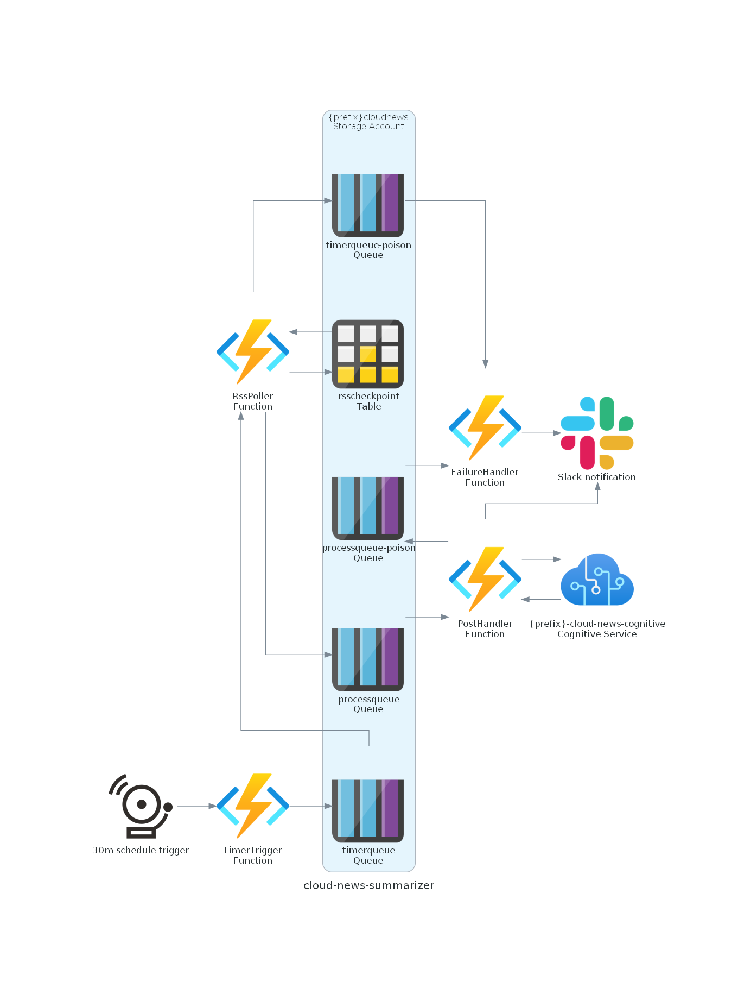

# cloud-news-summarizer
An Azure Function and associated resources that takes RSS feeds of cloud news (eg _AWS What's New_), generates a 3-sentence summary with Azure's Text Analytics, and sends the summary to Slack (with a link to the original post).

The Function polls the relevant RSS feeds every 30 minutes.

It is expected that the total usage cost of all the included resources (Functions, Storage Accounts, and Language Cognitive Services) will be approximately $1/month. For additional pricing information, see
- [Functions pricing](https://azure.microsoft.com/en-us/pricing/details/functions/)
- [Storage Account pricing](https://azure.microsoft.com/en-gb/pricing/details/storage/)
- [Language Cognitive Services pricing](https://azure.microsoft.com/en-gb/pricing/details/cognitive-services/language-service/)

## Architecture

## Usage / Deployment
Supporting resources are maintained in IaC with Pulumi. 
1. Head to the [pulumi/](./pulumi) directory and follow the instructions to deploy that stack.
2. Deploy the Azure Functions in the [functions/](./functions) directory using either the Functions CLI, or the VS Code extension, choosing the `python3.9` runtime. Ensure that you set the required Applications Settings as detailed below in the deployed Function App resource.
   - Note: If you deployed the Functions before setting the below config in the Function App resource, you may need to redeploy the functions for it to take effect.

The following Application Settings are required to be present on the deployed Function App:
- `AWS_ENABLED`: whether to poll for AWS news - set to `1` or `true` to enable
- `AZURE_ENABLED`: whether to poll for Azure news - set to `1` or `true` to enable
- `TABLE_SA_CONNECTION`: connection string for storage account created in Pulumi - _available in your Storage Account resource in the Portal_
- `TABLE_NAME`: table name within storage account - _listed as a Pulumi output_
- `ENVIRONMENT`: table row key - _string to differentiate multiple deployments, can be anything alphanumeric, eg `prod`_
- `TIMER_QUEUE_NAME`: timer queue name within storage account - _listed as a Pulumi output_
- `PROCESS_QUEUE_NAME`: processing queue name within storage account - _listed as a Pulumi output_
- `COGNITIVE_ENDPOINT`: endpoint URL (including `https://`) for the cognitive services resource - _listed as a Pulumi output_
- `COGNITIVE_KEY`: key for the Cognitive Services resource - _available in your Language resource in the Portal_
- `AWS_SLACK_WEBHOOK`: webhook URL for sending AWS news to Slack (not required if `AWS_ENABLED` is unset) - _see the [Slack docs](https://api.slack.com/messaging/webhooks) if you aren't sure_
- `AZURE_SLACK_WEBHOOK`: webhook URL for sending Azure news to Slack (not required if `AZURE_ENABLED` is unset) - _see the [Slack docs](https://api.slack.com/messaging/webhooks) if you aren't sure_
- `SLACK_FAILURE_WEBHOOK`: webhook URL for processing failure alerts to Slack - _can be the same or different to the normal Slack webhook (ie optionally send failures to a different channel)_

## Current feeds supported
Now:
- AWS What's New (https://aws.amazon.com/about-aws/whats-new/recent/feed/)
- Azure Updates (https://azurecomcdn.azureedge.net/en-gb/updates/feed/)

Next:
- GCP News (https://cloudblog.withgoogle.com/rss/)

